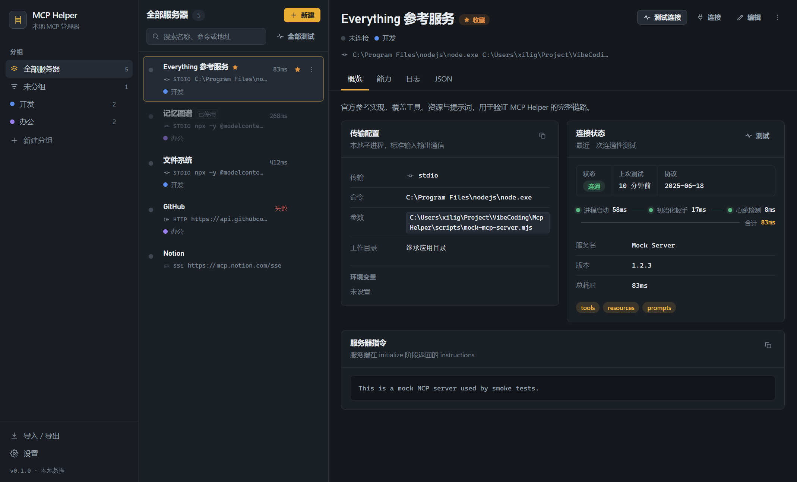
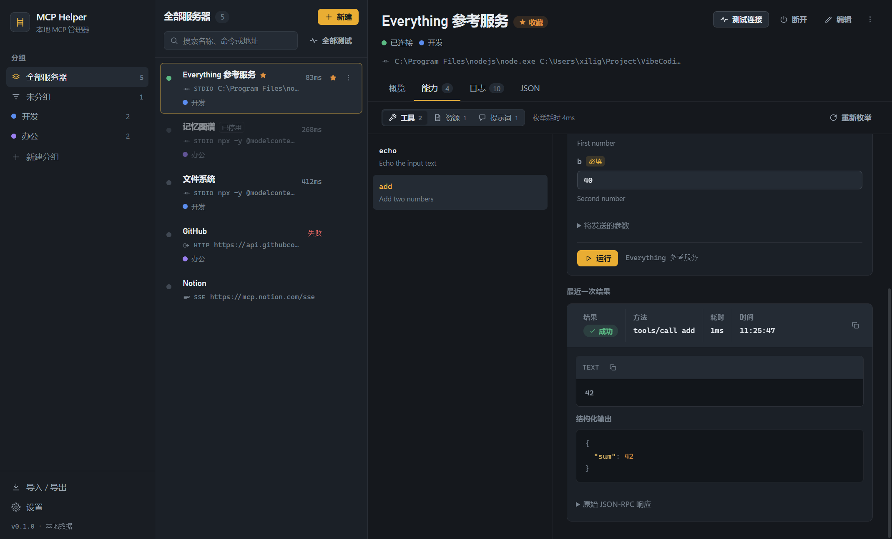
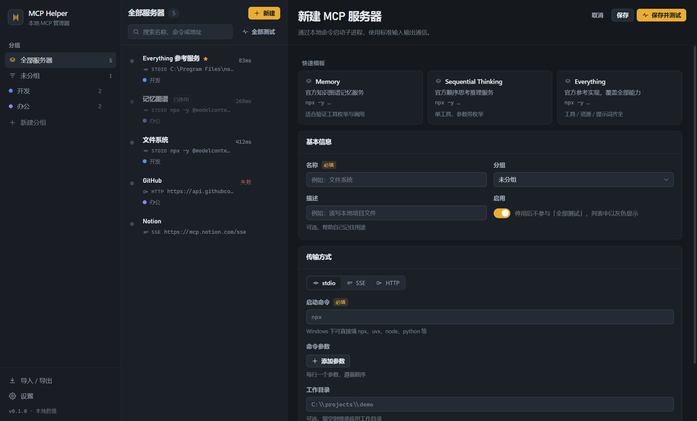

# MCP Helper

Windows 桌面端的 MCP（Model Context Protocol）服务器管理器：把散落各处的 MCP 配置集中到一处，随时验证连通性、枚举能力、测试调用。

A Windows desktop app to manage, test and debug MCP servers.



## 功能

**连接与配置**
- 支持 `stdio` / `SSE` / `Streamable HTTP` 三种传输，完整字段编辑（命令、参数、环境变量、工作目录、请求头）
- 分组、收藏、搜索、批量测试；删除后 8 秒内可撤销
- 导入：自动发现并解析 Claude Desktop / Cursor / VS Code / opencode / Claude Code 的现有配置，也可粘贴 JSON
- 导出：一键写入任意客户端配置（自动生成 `.mcp-helper.bak` 备份）或复制 JSON

**连通性测试**
- 真实执行 `initialize` 握手 + `ping`，不是简单的端口探测
- 显示「进程启动 / 初始化握手 / 心跳检测」三段耗时，慢在哪一段一目了然



**调用调试**
- 枚举 `tools` / `resources` / `prompts` / 资源模板
- 按 JSON Schema 自动生成表单（也可切换到原始 JSON），直接调用并查看返回：文本、图片、结构化输出、原始 JSON-RPC 报文
- 实时日志：子进程 stderr 与 JSON-RPC 事件流

**其他**
- 深色 / 浅色主题（跟随系统），`Ctrl+N` 新建、`Ctrl+K` 搜索、列表支持方向键与右键菜单
- 配置保存在 `%APPDATA%\MCP Helper\mcp-helper.json`，每次写入前自动备份



## 下载

从 [Releases](https://github.com/chenxilin1994/mcp-helper/releases) 下载：

- `MCP Helper-x.y.z-portable.exe` — 免安装，双击即用
- `MCP Helper-x.y.z-x64.exe` — 安装版，带开始菜单与桌面快捷方式

应用未做代码签名，首次运行时 SmartScreen 提示选择「更多信息 → 仍要运行」即可。

## 开发

```bash
npm install
npm run dev        # 开发运行（热更新）
npm run typecheck  # 类型检查
npm run smoke      # 主进程逻辑自测：内置 mock MCP 服务器，覆盖握手、枚举、调用、错误路径、配置导入导出
npm run capture    # 界面截图回归，输出到 .impeccable/review
npm run package    # 打包 Windows 安装包与便携版，输出到 release/
```

打包默认使用 npmmirror 镜像下载 Electron 二进制（国内网络），可用环境变量覆盖：

```bash
ELECTRON_MIRROR=... ELECTRON_BUILDER_BINARIES_MIRROR=... npm run package
```

## 技术栈

Electron + React + TypeScript，MCP 客户端基于官方 [`@modelcontextprotocol/sdk`](https://github.com/modelcontextprotocol/typescript-sdk)。
主进程负责子进程管理与 JSON-RPC，渲染进程只通过 `contextBridge` 暴露的类型化 API 通信。

```
src/
  main/       主进程：存储、MCP 客户端与连接池、客户端配置导入导出、IPC
  preload/    contextBridge API
  renderer/   React 界面
  shared/     主进程与渲染进程共享的类型
scripts/
  mock-mcp-server.mjs  最小 MCP 服务器（用于自测）
  smoke.ts             主进程自测
  capture.mjs          截图回归
  package.mjs          打包
```

## 许可

[MIT](LICENSE)
